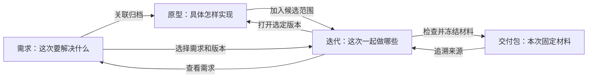

# Flowlark 功能关联与连续操作升级方案

日期：2026-09-12。状态：已实施并验证，详见[验收记录](../plans/2026-09-12-module-workflow-linkage-verification.md)。下文保留规划范围及取舍，无新版本号或工期承诺。

## 1. 本轮解决的问题

用户反馈迭代功能没有使用起来，进一步确认需要体现各功能之间的联系。本轮围绕“需求 → 原型 → 迭代 → 交付”连接已有能力，让用户在当前页面看清前后关系并继续操作。

产品目标：用户整理好需求和原型后，可以就地组织本次范围，进入迭代核对，再从该迭代准备交付；无需反复离开上下文重新寻找对象。

前两轮提出的角色待办、评审决策、结构化测试、签收和复盘等候选功能不纳入本轮，不作为已接受需求。

## 2. 当前证据与断点

以下为当前工作区静态检查结果，不代表浏览器实测或线上使用数据。

| 环节 | 已有能力及文件 | 本轮应补的连接 |
|---|---|---|
| 需求 → 原型 / 迭代 | `web/src/pages/RequirementWorkflow.tsx` 已展示关联原型和采用范围，可安排到已有规划中、评审中的迭代 | 在摘要中突出关联；安排成功后直接查看目标迭代；无迭代时保留选择创建 |
| 原型 → 需求 | `web/src/pages/ProjectVersions.tsx` 已有需求链接 | 在原型工作台补充该版本的候选、采用、历史迭代关系和操作入口 |
| 新建迭代 | `web/src/pages/Milestones.tsx` 当前以空 `items` 创建，再进入详情添加 | 从需求或原型进入时带入明确选择的范围，在创建前确认 |
| 迭代 → 需求 / 原型 | `web/src/pages/MilestoneDetail.tsx` 已有版本链接；需求编号是纯文本；“添加版本”需再次选择对象 | 以“需求及对应原型”组织范围，需求可点击，返回后定位原行 |
| 迭代 → 交付 | 迭代详情有“导出迭代包”；`DeliveryComposer.tsx` 要求从列表选择来源迭代 | 提供“准备交付包”，预填当前迭代，复用现有材料检查与冻结流程 |
| 交付 → 来源 | `DeliveryDetail.tsx` 已有来源迭代和源版本链接 | 在迭代、需求、原型中反查相关交付；补充回到来源的上下文 |

关键约束来源：`src/core/milestones.js`、`src/core/requirement-workflow.js`、`src/core/service.js`、`docs/REQUIREMENT-WORKFLOW.md`、`docs/DELIVERY.md`。

## 3. 用户看到的关系

图表示操作关系，不是新增状态机。需求可以关联多个项目和原型版本；同一需求可被多个迭代使用，一个迭代也可产生多次交付。页面不能把它们压成单一进度百分比。

建议每个详情页用一段简短关系摘要表达当前事实，例如：

> 关联原型 2 个 · 迭代 2 个 · 相关交付 1 次

每项展开后展示具体对象与关系类型。不要使用“一步已完成”暗示后续对象必然存在，或暗示需求已开发完成。

## 4. 五项具体改动

### L1. 需求详情：从“看资料”接到“安排本次工作”

- 在现有详情摘要附近展示关联原型、候选 / 采用迭代和相关交付；复用现有开发依据数据，不新增独立模块。
- 点击关联数量可定位当前页相应区块；点击具体对象进入其详情。
- 保留“安排到迭代”，选择明确的项目和原型版本；不要默认选择最新版本作为采用依据。
- 安排成功后展示目标迭代、选定版本，以及“查看迭代”入口；留在原页也能看到刷新后的关联。
- 无原型时展示“先关联归档原型”，跳到已有关联操作。已有原型但没有迭代时，可以“新建迭代并加入”。
- 不将所有历史迭代混成“已安排”标记。已取消、已归档等关系明确说明，避免用户误以为本次已安排。

### L2. 原型详情：看清当前版本用在哪里

- 在原型工作台展示该精确版本关联的需求，以及包含该版本的迭代；点击可跳转。
- 规划中、评审中显示“候选版本”；冻结、进行中等阶段按既有语义显示采用及历史关系。取消迭代单独标记。
- 提供“加入迭代”入口，固定当前项目和版本；若关联多条需求，由用户选择本次纳入的需求，不自动全部加入。
- 未关联需求时先进入关联操作。已锁定版本沿用现有约束，不能借新入口绕过。
- “已有新归档”和“本迭代采用当前版本”可以同时显示。新归档、基线变化均不会自动改写范围。
- 项目版本列表首批只增加简短关系提示与详情入口，复杂选择集中在工作台，避免每行堆积按钮。

### L3. 就地安排：带着已选内容创建或选择迭代

统一用户流程：

1. 查看已选需求、项目、版本。
2. 选择已有可编辑迭代，或就地填写新迭代资料。
3. 查看将新增、已存在、可能替换的具体范围。
4. 用户确认后保存，提供“查看迭代”和原页刷新结果。

细节：

- 从需求页进入时固定需求，可选择关联项目版本；从原型页进入时固定项目版本，选择已关联需求。
- 新迭代沿用现有标识、标题和周期要求。名称冲突时保留输入；取消不创建空迭代。
- 新建时利用现有创建接口的 `items` 输入一次提交名称与选定范围，避免“先建空迭代，再加内容”的半完成状态。
- 同一映射已在目标迭代中时展示“已在范围中”，不重复添加。
- 已有范围发生变化时重新读取并展示差异，保留用户选择供核对，不能盲目重放旧的完整 `items`。
- 冻结或进行中的迭代显示不可直接加入的原因，并链接到既有生命周期 / 范围变更入口。点击链接不会自动执行变更。

### L4. 迭代详情：用需求组织本次范围

- 页面首先解释“本次包含哪些需求，以及各自选定的原型”。显示去重后的需求数、项目数和原型版本数；不要把映射行数标成版本数。
- “版本范围”展示需求编号和标题、项目、选定版本、范围性质与现有风险提示。需求和版本都可点击。
- “添加版本”文案改为“添加需求与原型”，明确操作对象；保留现有添加能力。
- 空范围给出可执行的添加入口及说明，不只展示“本轮还没有版本”。
- 范围内容优先展示，外部任务同步仍保留在独立区块；不以配置外部平台作为阅读范围的前置条件，也不改变既有状态流转要求。
- 增加“本迭代交付”区块，按交付元数据中的来源迭代列出材料包；多次交付分别展示。
- 增加“准备交付包”入口；“导出迭代包”和“正式发版”继续保留各自语义，不冒充交付冻结操作。

### L5. 迭代到交付：预填来源并支持返回继续

- 从迭代进入交付准备，预填来源迭代；仍展示完整范围，继续使用现有检查、交接说明和冻结步骤。
- 沿用现有交付资格判断，不新增“必须进行中”等阶段限制；不因为列表显示“可交付”而跳过服务端检查。
- 检查问题继续提供对应版本材料入口；补充后返回原准备流程，保留标题、用途、交接说明等输入，并重新检查。
- 用户修改来源迭代后，旧检查结果立即失效，重新读取范围。
- 创建成功进入交付详情，同时展示“返回来源迭代”；原迭代刷新后可以看到新交付。
- 本轮新导航入口不自动触发正式发版或发送消息；显式创建交付时沿用已有通知入队行为，不能因重复进入页面重复创建或入队。

## 5. 跳转上下文与数据事实

### 导航上下文

- 记录来源对象、来源页签、选中版本及必要的列表筛选；跨模块返回后恢复这些上下文。
- 从迭代进入需求或版本时展示“来自：某迭代”，可返回对应范围行。该提示是浏览上下文，不重新定义全局采用版本。
- 可复制链接携带必要对象标识；在新窗口打开时仍能识别当前需求 / 版本 / 迭代，缺少来源则使用正常详情页。
- URL 参数仅用于定位和预填，不能构成写入授权或业务事实；只接受应用内部的受支持返回地址。
- 刷新后重新读取真实关系。对象已删除、无权限或读取失败分别说明，不能把失败显示成“尚未关联”。
- 交付准备的未提交输入暂存在当前标签页的本地草稿中，按工作区区分；保存或主动放弃后清除，不进入 Git。只保存用户输入和对象标识，检查结果返回后重新获取。

### 关联事实

| 关系 | 来源与匹配口径 |
|---|---|
| 需求关联原型 | 现有归档版本的需求关联及需求工作流聚合 |
| 迭代选定范围 | 迭代 `items` 中的需求、项目、版本组合 |
| 原型被哪些迭代使用 | 按项目和版本精确匹配迭代范围，保留对应需求；不能只按版本号匹配 |
| 迭代产生哪些交付 | 交付元数据的来源迭代标识 |
| 需求相关交付 | 交付冻结范围中明确包含该需求 |
| 原型相关交付 | 交付冻结范围中明确包含该项目和版本；版本共同出现不代表该版本承载包内全部需求 |

不额外落库 `currentIteration`、`isDelivered` 等镜像字段；列表摘要与详情使用同一关系口径。缺少完整映射的旧交付只显示可证实的关系，并提示信息不完整。

## 6. 实施顺序与涉及文件

| 批次 | 范围 | 主要文件 | 退出条件 |
|---|---|---|---|
| A：先把关系看清 | 需求 / 原型 / 迭代关联摘要、需求链接、迭代交付列表、返回定位 | `RequirementWorkflow.tsx`、`RequirementDetail.tsx`、`VersionWorkbench.tsx`、`MilestoneDetail.tsx`、`DeliveryDetail.tsx`；按需扩展现有只读聚合 | 任意关联对象可顺着链接到达；多迭代、多项目、历史关系准确 |
| B：带上下文安排 | 复用已有安排弹窗，增加原型入口、就地新建与成功后续操作 | `RequirementWorkflow.tsx`、`Milestones.tsx`、原型工作台；必要时提取共享安排组件 | 从已有需求或原型进入，无需重复寻找源对象即可安排并到达迭代 |
| C：接到交付 | 迭代准备交付入口、来源预填、材料修复返回、输入恢复 | `MilestoneDetail.tsx`、`Deliveries.tsx`、`delivery/DeliveryComposer.tsx` | 从迭代完成材料检查和交付冻结，再返回可见新交付 |

数据层优先复用 `src/core/requirement-workflow.js`、`milestones.js`、`snapshots.js` 与服务层查询。只有现有响应无法表达所需关系时才补充只读字段或接口；先不引入通用关系引擎、数据库或新业务状态。

当前工作区已有未提交的原型工作台及新版本弹窗修改，后续实施前应重新核对差异并在其基础上修改，不覆盖已有工作。

## 7. 验收场景

| 编号 | 场景 | 预期 |
|---|---|---|
| A1 | 需求已关联原型，但没有迭代 | 可从需求页就地创建并加入；创建前能核对范围；取消无新增迭代 |
| A2 | 从原型进入安排，关联两条需求，只选择一条 | 仅加入明确选择的组合，另一条不被自动安排 |
| A3 | 同一需求在两个迭代采用不同版本 | 分别显示；从每个迭代打开时保持对应版本及来源 |
| A4 | 不同项目都存在 v1.2 | 查询、计数和跳转不串项目 |
| A5 | 新增 v1.3，而迭代仍选 v1.2 | 显示新归档提示；采用范围保持 v1.2 |
| A6 | 目标迭代在确认前已被修改或锁定 | 说明变化并重新读取；不覆盖他人范围、不绕过锁定 |
| A7 | 从迭代打开需求，再返回 | 恢复原迭代及范围行；原选定版本不丢失 |
| A8 | 从迭代准备交付，跳到原型补材料再返回 | 表单输入保留；来源和检查结果重新校验 |
| A9 | 同一迭代创建两份交付包 | 两份均可追溯；不把后一次视为对前一次文件的覆盖 |
| A10 | 只读访客与研发 / 测试角色浏览关联 | 按现有权限允许查看；新写入口不能越权，API 同样检查 |
| A11 | 关联数据请求失败、旧数据缺失或来源已删除 | 明确提示异常或缺失；不展示错误的“尚未安排” |
| A12 | 重复点击安排或重复进入交付页面 | 不新增重复映射；打开页面不自动创建交付或发送通知 |

代码实施时，对新增关系匹配及有状态写入补充有意义的测试；浏览器验证完整路径、返回恢复、多迭代及角色权限。按仓库要求执行相关回归与构建。本次规划未执行这些检查。

试用验证先观察产品本人是否能从需求 / 原型自然进入迭代并完成一次交付，记录重复选择对象的位置和中断原因；未取得样本前不承诺使用率或效率提升百分比。

## 8. 需要在相应实现前核对的规则

1. **同需求、同项目、多版本映射**：当前需求页安排操作会替换该组合的旧候选版本，但核心规范化按完整三元组去重，允许同需求同项目存在不同版本。第一批保留所有历史映射，不擅自清理。共享安排入口上线前，需要确认多版本是合法场景还是历史不一致；未明确时保留原值，显式展示冲突，不自动选一个。
2. **需求关联与迭代映射不一致**：核心迭代校验确认对象存在，但不等同于确认归档版本确实关联该需求。历史不一致应提示核对，不能通过展示层偷偷补关系。新快捷入口从已关联对象选择。
3. **写入冲突保障**：现有需求页在写前比较 `updatedAt`，核心更新未在该方法内接收预期修订条件。不要把这种前端比较当成完整并发保护。B 批次应核对路由与写入契约，必要时补服务端条件更新和写入串行保护，避免整份范围覆盖。

这些问题不阻塞 A 批次的只读关系展示，但会影响 B 批次写入行为；进入相应实施时再作具体决策。

## 9. 取舍与完成边界

推荐“就地连接已有页面”：保留模块分工，补上关系、行动入口和上下文。收益是复用现有能力、减少重新找对象；代价是跨页状态恢复需要维护，复杂的多对多关系仍需清楚展示。

备选是建设一页贯穿需求、原型、迭代与交付的工作台。它能减少跳转，但会增加单页复杂度及重复实现，暂不作为首批。若试用表明页面连接完善后仍频繁迷路，再评估该备选。

外部参照沿用本轮前序已查阅的 Penpot 评论上下文和 Plane 工作项 / 迭代组织：可借鉴对象之间直接到达的方式，不能据此引入账号体系或完整项目平台。本稿的具体页面决策以本地代码和用户反馈为依据，未做新的竞品实测或成本估算。

- Penpot：https://help.penpot.app/user-guide/designing/workspace-basics/
- Plane：https://docs.plane.so/

规划阶段仅新增本文档；后续已按用户授权完成本地实施、测试与服务重启，实际结果以验收记录为准。没有执行远端发布或主动对外发送消息。
